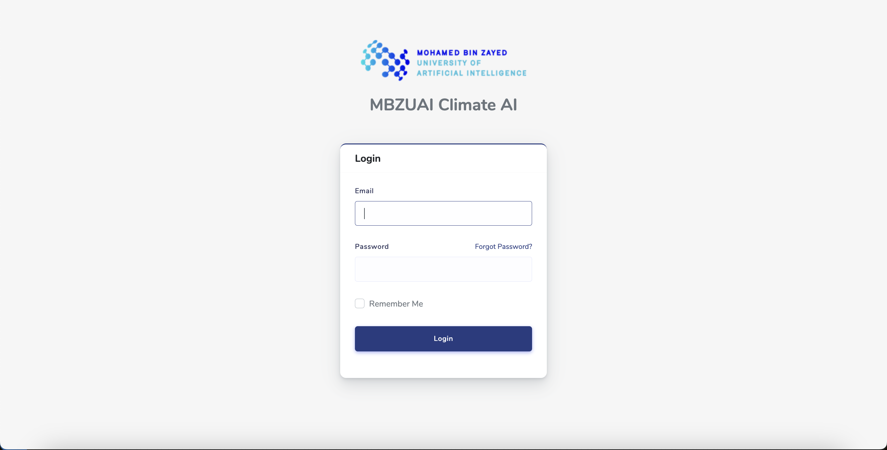
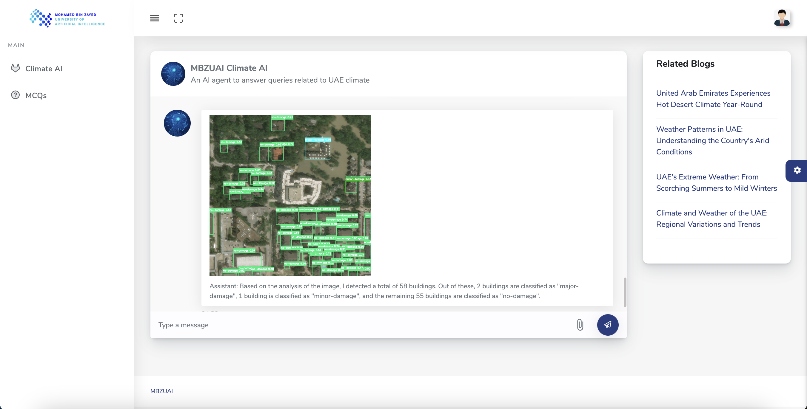
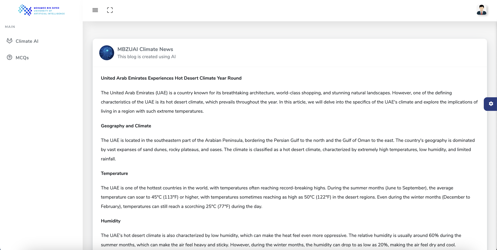
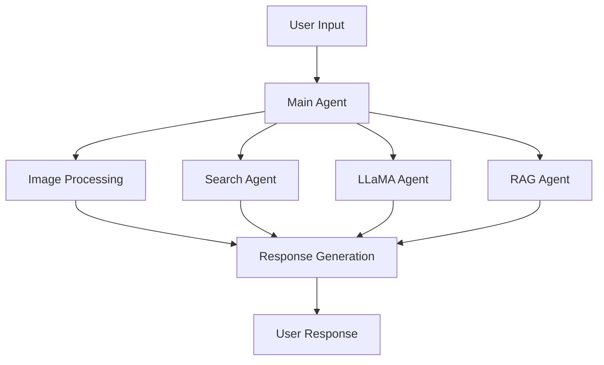

# MBZUAI Climate AI Assistant 🌍

<div align="center">

[](https://laravel.com)
[](https://www.python.org)
[](https://www.trychroma.com)
[](https://ai.meta.com/llama)

[View Presentation](https://docs.google.com/presentation/d/1ibRg5sHTLqK8_YnJoAZVNK-hAOxrkiM6/edit?usp=sharing&ouid=112266298343109239222&rtpof=true&sd=true)

<p align="center">



</p>

</div>

## 🌟 Features

The MBZUAI Climate AI Assistant provides comprehensive climate-related assistance with a focus on UAE:

- 🌡️ **Real-time Climate Information**
  - Current weather patterns
  - Environmental conditions
  - Climate change indicators

- 📰 **Climate Change News & Insights**
  - Latest environmental developments
  - Policy updates
  - Regional climate initiatives

- 👣 **Carbon Footprint & Sustainability**
  - Personal carbon impact assessment
  - Sustainability recommendations
  - Green lifestyle advice

- 🛠️ **Climate Mitigation Strategies**
  - Adaptation techniques
  - Resource conservation
  - Environmental protection measures

- 🛰️ **Satellite Image Analysis**
  - Post-disaster assessment
  - Environmental impact studies
  - Building damage analysis

- ⚡ **Renewable Energy & Technology**
  - Clean energy developments
  - Technological innovations
  - Sustainability solutions

## 🚀 Installation

### Frontend Setup (Laravel)

1. Install PHP dependencies:
```bash
composer install
```

2. Create and configure `.env` file:
```bash
cp .env.example .env
php artisan key:generate
```

3. Configure database in `.env`:
```env
DB_CONNECTION=mysql
DB_HOST=127.0.0.1
DB_PORT=3306
DB_DATABASE=your_database
DB_USERNAME=your_username
DB_PASSWORD=your_password

TOGETHER_AI_KEY=your_together_ai_key
```

4. Run migrations and seed the database:
```bash
php artisan migrate
php artisan db:seed
```

5. Start the development server:
```bash
php artisan serve
```

### Backend Setup (Python)

1. Navigate to backend directory and install dependencies:
```bash
cd backend
pip install -r requirements.txt
```

2. Create and configure `.env` file:
```env
TAVILY_API_KEY=your_tavily_key
TOGETHER_API_KEY=your_together_key
ROBOFLOW_API_KEY=your_roboflow_key
```

3. Download and setup ChromaDB:
- Download the vector database file from [Google Drive](https://drive.google.com/file/d/1WM2Nu6y5p8qR7XX6777YKqfvG6fX3qCD/view?usp=sharing)
- Extract and place in `/backend/chroma_db`

4. Start the backend server:
```bash
python app.py
```

## 🔑 Default Login

Access the application at http://localhost:8000

```
Email: user@test.com
Password: 12345678
```

## 🏗️ Architecture

The system utilizes a sophisticated multi-agent architecture:



## 💻 Technology Stack

- **Frontend**: Laravel, Blade Templates, TailwindCSS
- **Backend**: Python, Flask
- **AI/ML**: Meta LLaMA, ChromaDB, Sentence Transformers
- **APIs**: Together AI, Tavily, Roboflow
- **Database**: MySQL, ChromaDB (vector store)

## 📝 License

This project is licensed under the MIT License - see the [LICENSE](LICENSE) file for details.

## 🤝 Contributing

Contributions are welcome! Please feel free to submit a Pull Request.

## 🙏 Acknowledgments

- MBZUAI for support and resources
- Meta AI for LLaMA model
- The open-source community

---

<div align="center">
Made with ❤️ by the MBZUAI Climate AI Team
</div>